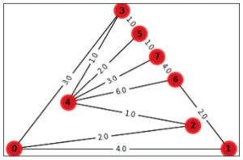

# Solving the Minnimum Spanning Tree problem 

## Table of Contents
* [Introduction](#introduction)
* [Prim's Algorithm](#prims-algorithm)
* [Technologies](#technologies)
* [Sources](#sources)

## Introduction
Math 2305 Final Project by Austin Foster, Gabriel Ceballos, Lymari Nguyen, Mauricio Aramburu, and Minh Thach.

In this project we are implementing Prim's Algorithm to solve the minimum spanning tree problem. We are using set graphs, which we have solved for the MST manually, to verify the functionality of the project.

## Prim's Algorithm 
Prim's algorithm is a greedy algorithm that is guaranteed to return the Minimum Spanning Tree (MST) for a weighted undirected graph. [^1] The algorithm will start at any given vertex. From there it will then choose to travel along the minimum cost edge in the graph that (1) maintains the tree and (2) does not create a cycle, or loop. It will continue to iterate until the resulting tree spans the graph, i.e. the vertex set of the tree created by Prim's algorithm, V(T), contains the same elements (vertices) as the vertex set of the graph, V(G). 

### Graph Example
This is an example of a graph created by our program. Of course, the graph will change according to the Gx.txt file that the program runs. 

*Note: This is the graph before Prim's algorithm was run. After Prim's the edges that make up the MST will be highlighted.*

### Technologies
* Anaconda Navigator
* Spyder - Scientific Python IDE ver. 4.1.4
* Using libraries: `networkx`, `matplotlib`

### Sources
* [Readme markdown cheat sheet](https://github.com/adam-p/markdown-here/wiki/Markdown-Cheatsheet)
* [Badges](https://github.com/Naereen/badges)
